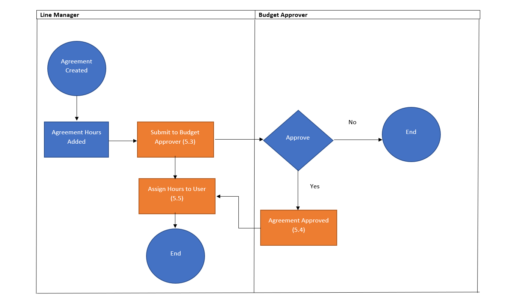

# My Database Portfolio

> Hello everyone that views this portfolio.

My name is Aaron Barkas and I am an I.T professional with over 3.5+ years experience in the I.T industry.

Skills Include:

- Database Design
- SSRS
- SSIS
- SQL
- PowerBI
- Stakeholder Management
- Jira and confluence
- Technical Writing
- Functional Testing
- Manual Testing

# Power BI Examples

These are my power BI Example, In previous employment I used SSRS for reports instead.

## Flight satisfaction review reports

In this Power BI report we can filter customer by gender and age to check satisfaction of the flight, average rating of onboard amenities. It also includes a donut chart to categorise flight delays by a specific type which can be selected to see if it influences the overall satisfaction of the flight.

## Hotel report

In this Power BI report we are able to see year profit based on the selection. We are ablso able to see the percentage of returned customers, the average rating of the hotels and a hotel location map.

# Database Design

In this section I will display the database designs I have used professionally or in my free time.

## Hotel travel search ERD diagram

This diagram was created by categorising the components of a travel hotel booking company.

## Fact and Dim tables for Hotel Review analysis

This Fact and Dim star schema allows data to be inserted and queried for data analysis.

## Fact and Dim Tables for Flight Booking Analysis

This Fact and Dim star schema allows data to be inserted and queried for data analysis.

## Price Comparison Customer Data Example

This design wasn't used professionally but is based of the potential data a price comparison site will collect to compare customer data to match with the best quote from insurance providers. 

## Carpark System

In my previous employment I assisted with the created of a new carpark database to be used as a web application. This isn't the same design but has been changed as to not infringe any Intellectual property.

### ERD Carpark System Diagram

ERD diagram displays the relationships between each table within the database.

### Use Case Carpark System Diagram

A use case diagram details the different tasks that a user will be able to perform on the system.

# Web Application Documentation Examples

Any information in these examples of my work were created by me and are GDPR and Intellectual Property compliant and contain no identifiable data or application source code. Examples here are of generic Create Read Update Delete database web application examples. 

## Overtime Web Application

The overtime web application was created to allow staff to submit overtime claims. I was tasked to create the documentation from a managers perspective so that they could understand the system without the technical knowledge to do so.

### Site Map

The site map was created by me to show the different web pages on the web application and how a user would navigate from each page.

### Overtime Process Flow

The process flow was to show the user journey and the interaction between different users and their departments for the web application. Note. Orange objects referred to email examples in later sections of the documentation for GDPR and Intellectual Property issues I will not be able to display those email examples later in this portfolio.

 

### Process flow - Manager View

The manager view shows the user journey for the manager of the web application.

