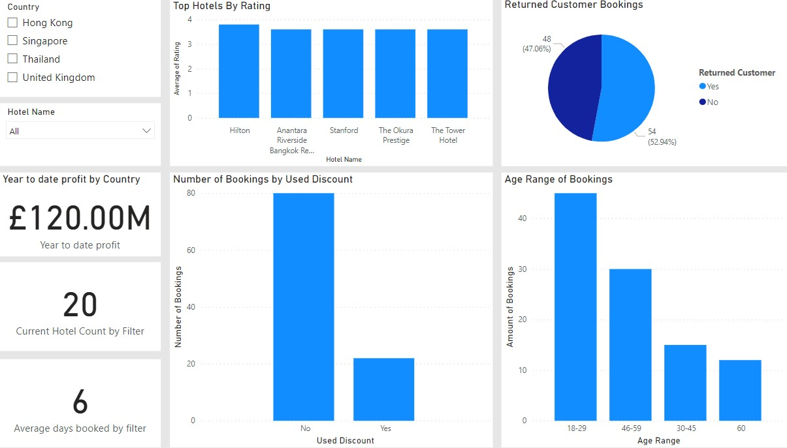

# My Database Portfolio

> Hello everyone that views this portfolio.

My name is Aaron Barkas and I am an I.T professional with over 3.5+ years experience in the I.T industry.

Skills Include:

- Database Design
- SSRS
- SSIS
- SQL
- PowerBI
- Stakeholder Management
- Jira and confluence
- Technical Writing
- Functional Testing
- Manual Testing

# Power BI Examples

These are my power BI Example, In previous employment I used SSRS for reports instead.

## Flight satisfaction review reports

In this Power BI report we can filter customer by gender and age to check satisfaction of the flight, average rating of onboard amenities. It also includes a donut chart to categorise flight delays by a specific type which can be selected to see if it influences the overall satisfaction of the flight.

## Hotel report

In this Power BI report we are able to see year profit based on the selection. We are ablso able to see the percentage of returned customers, the average rating of the hotels and a hotel location map.

# Database Design

In this section I will display the database designs I have used professionally or in my free time.

## Hotel travel search ERD diagram

This diagram was created by categorising the components of a travel hotel booking company.

## Fact and Dim tables for Hotel Review analysis

This Fact and Dim star schema allows data to be inserted and queried for data analysis.

## Fact and Dim Tables for Flight Booking Analysis

This Fact and Dim star schema allows data to be inserted and queried for data analysis.

## Price Comparison Customer Data Example

This design wasn't used professionally but is based of the potential data a price comparison site will collect to compare customer data to match with the best quote from insurance providers. 

